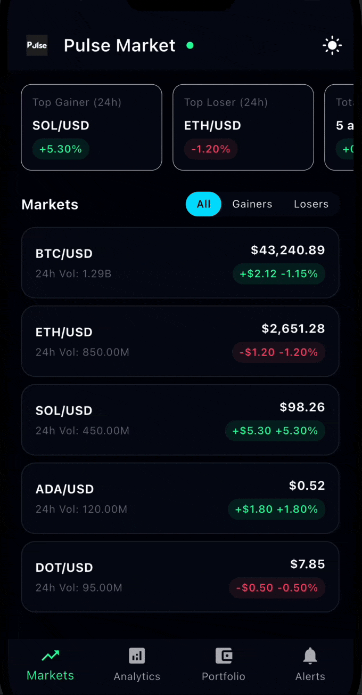
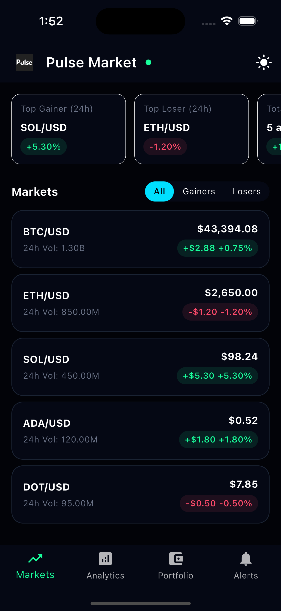
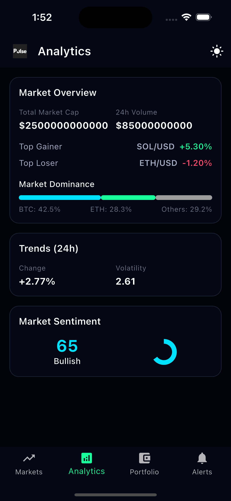
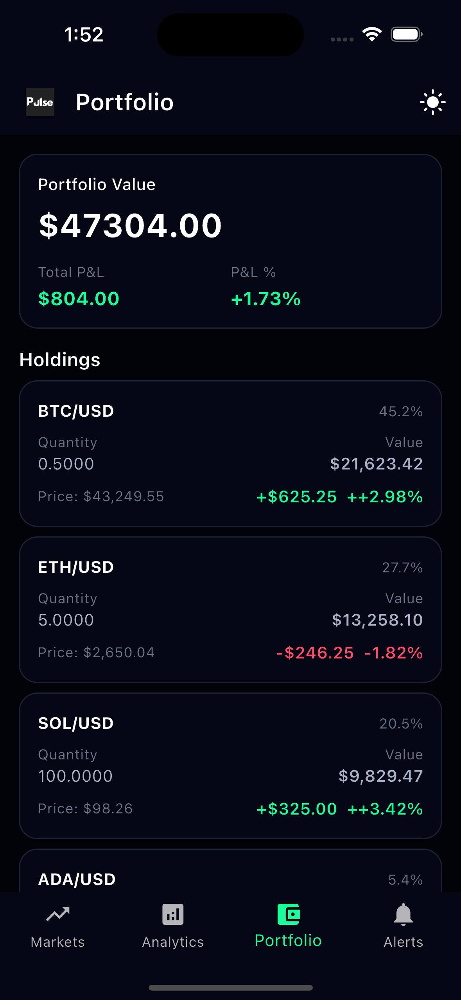

# PulseNow Flutter Assessment

A Flutter application demonstrating real-time crypto market data integration with REST API and WebSocket support.

## Demo



## Screenshots

| Dashboard | Analytics | Portfolio |
|-----------|-----------|-----------|
|  |  |  |

## Features

### ✅ Core Features (Required)
- **Market Data Display**: List of crypto market symbols with real-time price updates
- **REST API Integration**: Fetches initial market data from `/api/market-data`
- **State Management**: Uses Provider pattern for state management
- **Error Handling**: Comprehensive error states with retry functionality
- **Loading States**: Shimmer loading effects during data fetch
- **Empty States**: User-friendly empty state when no data is available

### ⭐ Nice-to-Have Features (Implemented)
- **Pull-to-Refresh**: Swipe down to refresh market data
- **Real-Time Updates**: WebSocket integration for live price updates
- **Advanced Formatting**: Currency, percentage, and volume formatting with extensions
- **Theme Support**: Light and dark mode with PulseNow brand colors
- **Internationalization Ready**: All strings extracted to constants for future translation

## Setup

1. **Prerequisites**: Flutter 3.0+ installed

2. **Install dependencies**:
```bash
flutter pub get
```

3. **Start the backend server** (see `../backend/README.md`):
```bash
cd ../backend
npm install
npm start
```

4. **Configure API endpoints** (if needed):
   - Edit `lib/utils/constants.dart`
   - For Android emulator: Use `10.0.2.2` instead of `localhost`
   - For iOS simulator: `localhost` works fine

5. **Run the app**:
```bash
flutter run
```

## Project Structure

```
lib/
├── main.dart                      # App entry point with theme configuration
├── core/
│   ├── routes/                    # Navigation (go_router)
│   ├── services/
│   │   ├── http/                  # HTTP service wrapper
│   │   └── websocket/             # WebSocket service with auto-reconnect
│   └── theme/                     # App theming (light/dark mode)
├── models/                        # Data models
│   └── market_data_model.dart
├── providers/                     # State management (Provider pattern)
│   ├── market_data_provider.dart
│   ├── analytics_provider.dart
│   └── portfolio_provider.dart
├── screens/                       # UI screens
│   ├── dashboard_screen.dart     # Main dashboard with markets
│   ├── analytics_screen.dart     # Analytics overview
│   └── portfolio_screen.dart     # Portfolio management
├── services/                      # API services
│   └── api_service.dart
├── shared/
│   └── widgets/                   # Reusable widgets
│       ├── shimmer_widget.dart
│       └── bottom_nav_bar.dart
└── utils/                         # Utilities
    ├── constants.dart             # App constants (API endpoints, colors)
    ├── formatters.dart            # Number formatting extensions
    └── strings.dart               # String constants (i18n ready)
```

## Architecture & Decisions

### **Layered Architecture**
- **Models**: Data classes with safe JSON parsing (`MarketData`)
- **Services**: API abstraction layer (`ApiService`, `HttpService`, `WebSocketService`)
- **Providers**: State management using Provider pattern (`MarketDataProvider`)
- **UI**: Presentation layer with reactive widgets (`MarketDataScreen`)

### **State Management: Provider Pattern**
- Chosen for simplicity and assessment requirements
- `ChangeNotifier` pattern with `notifyListeners()` for UI updates
- Clean separation of business logic from UI

### **Real-Time Updates: WebSocket Integration**
- **Initial Load**: REST API fetches complete market data
- **Live Updates**: WebSocket connects after initial load and receives `market_update` messages
- **Auto-Reconnect**: Automatic reconnection with exponential backoff (max 5 attempts)
- **Type Safety**: Handles both string and numeric values from backend (defensive parsing)

### **Error Handling Strategy**
- Centralized error handling in `HttpService`
- Provider exposes error state for UI display
- Retry functionality on error widgets
- Graceful degradation when WebSocket fails (REST API still works)

### **Performance Optimizations**
- `ListView.builder` for efficient list rendering
- `const` constructors where possible
- Shimmer loading to reduce perceived load time
- Selective UI updates via `notifyListeners()` only when data changes

### **Code Quality**
- All user-facing strings extracted to `AppStrings` for future i18n
- Extension methods for number formatting (idiomatic Dart)
- Reusable widgets (ShimmerWidget, error states)
- Consistent naming conventions and file organization

## WebSocket Integration

The app includes WebSocket support for real-time market updates:

### **Connection Flow**
1. Initial data loaded via REST API
2. WebSocket connects to `ws://localhost:3000` (or configured URL)
3. Listens for `market_update` messages
4. Updates matching symbols in the list automatically

### **Message Format**
```json
{
  "type": "market_update",
  "data": {
    "symbol": "BTC/USD",
    "price": "43250.50",
    "change24h": "2.5",
    "volume": "1250000000",
    "timestamp": "2026-01-17T07:22:27.295Z"
  }
}
```

### **Reconnection Strategy**
- Automatic reconnection on disconnect/error
- Maximum 5 reconnect attempts
- 3-second interval between attempts
- Connection state exposed via stream

### **Heartbeat Mechanism**
- Sends "ping" every 10 seconds to keep connection alive
- Detects dead connections if no "pong" response (3 missed = reconnect)
- Backend should implement ping/pong handling for full functionality

## Testing

### **Tested Scenarios**
- ✅ Backend running: Data loads and updates correctly
- ✅ Backend stopped: Error state displays with retry button
- ✅ WebSocket updates: Real-time price changes reflect in UI
- ✅ Pull-to-refresh: Manually refreshes data
- ✅ Theme switching: Light/dark mode works correctly

### **Platform Testing**
- ✅ Android emulator (using `10.0.2.2` for localhost)
- ✅ iOS simulator (using `localhost`)

## Dependencies

- `provider`: State management
- `http`: REST API calls
- `web_socket_channel`: WebSocket support
- `shimmer`: Loading shimmer effects
- `intl`: Number formatting

## Notes

- Provider pattern chosen for state management simplicity
- WebSocket includes heartbeat mechanism for connection health monitoring
- All user-facing strings centralized in `AppStrings` for easy internationalization
